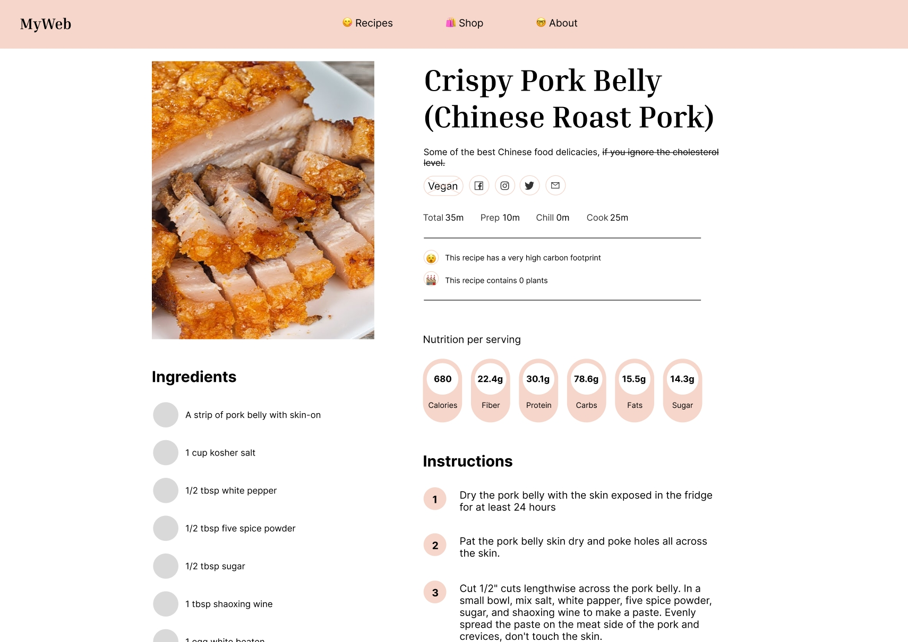

# Notes
## Clarify the problem
Ask your stakeholders:
- What is the project?
- What problem is it solving?
- How do we know its a problem?
- Who is it for?
- Where is this page or tool going to live?

## Tools
I personally prefer Figma it's used a lot in the UX industry. I'm more familiar with the UI and graphic design workflow on Figma but I might try Omnigraffie for web design.

# Wireframe Work
https://www.figma.com/proto/2dWFuHBr85OWTFQcRFiPLu/Untitled?page-id=0%3A1&type=design&node-id=0-1&viewport=1069%2C359%2C0.96&t=HqdnV8zYvkeJWs20-1&scaling=min-zoom&mode=design

Preview:
